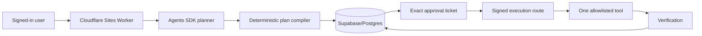

# Current architecture

## Product path

Supabase Auth supplies the stable user UUID. The Worker validates that session, derives ownership, and never accepts an owner ID from request JSON. Supabase/Postgres is the only system of record. D1 is disabled. R2 remains reserved for future large artifacts; MVP outputs fit Postgres limits.

The model proposes plan language. `compileSafePlan()` discards any implied capability and selects one entry from a frozen registry. The action hash binds task, step, tool version, canonical arguments, risk, and effect metadata. Browser roles cannot directly insert authoritative tasks, steps, approvals, outputs, events, executions, or receipts.

Trusted lifecycle RPCs require a short-lived HMAC signature computed in the Worker and verified with a separate secret stored in Supabase's private schema. The secret never reaches browser code. User decision RPCs can approve, reject, cancel, or retry only the caller's own rows and perform compare-and-set transitions.

## Runtime boundaries

- Browser: presentation, OAuth start, task request, exact user decisions. No secrets or provider credentials.
- Worker: session validation, planning, deterministic policy, signatures, agent runs, redacted logs.
- Public Supabase schema: owner-readable product records protected by grants and RLS.
- Private Supabase schema: runtime HMAC and future encrypted connector material; no browser grants.
- Model: untrusted proposer and content generator. It cannot grant tools or write receipts.

Cloudflare Workflows/Queues remain the production direction for long-running connector effects. They are intentionally not claimed as active in this synchronous, single-safe-tool MVP.
